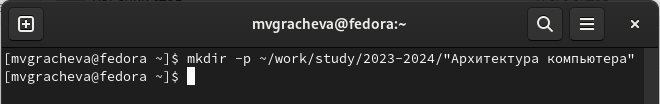
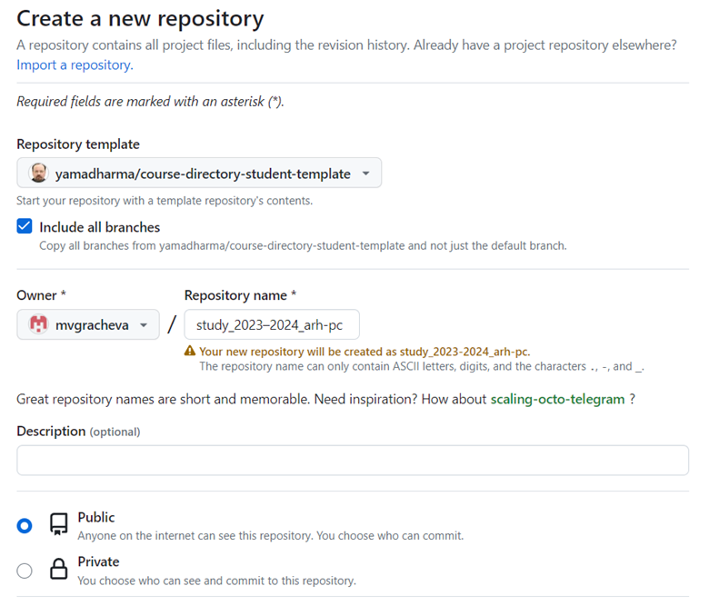

---
## Front matter
title: "Лабораторная работа №2"
subtitle: "Система контроля версии Git"
author: "Мария Валерьевна Грачева"

## Generic otions
lang: ru-RU
toc-title: "Содержание"

## Bibliography
bibliography: bib/cite.bib
csl: pandoc/csl/gost-r-7-0-5-2008-numeric.csl

## Pdf output format
toc: true # Table of contents
toc-depth: 2
lof: true # List of figures
lot: true # List of tables
fontsize: 12pt
linestretch: 1.5
papersize: a4
documentclass: scrreprt
## I18n polyglossia
polyglossia-lang:
  name: russian
  options:
	- spelling=modern
	- babelshorthands=true
polyglossia-otherlangs:
  name: english
## I18n babel
babel-lang: russian
babel-otherlangs: english
## Fonts
mainfont: PT Serif
romanfont: PT Serif
sansfont: PT Sans
monofont: PT Mono
mainfontoptions: Ligatures=TeX
romanfontoptions: Ligatures=TeX
sansfontoptions: Ligatures=TeX,Scale=MatchLowercase
monofontoptions: Scale=MatchLowercase,Scale=0.9
## Biblatex
biblatex: true
biblio-style: "gost-numeric"
biblatexoptions:
  - parentracker=true
  - backend=biber
  - hyperref=auto
  - language=auto
  - autolang=other*
  - citestyle=gost-numeric
## Pandoc-crossref LaTeX customization
figureTitle: "Рис."
tableTitle: "Таблица"
listingTitle: "Листинг"
lofTitle: "Список иллюстраций"
lotTitle: "Список таблиц"
lolTitle: "Листинги"
## Misc options
indent: true
header-includes:
  - \usepackage{indentfirst}
  - \usepackage{float} # keep figures where there are in the text
  - \floatplacement{figure}{H} # keep figures where there are in the text
---

# Цель работы

Целью работы является изучить идеологию и применение средств контроля версийю Приобрести практические навыки по работе с системой git

# Теоретическое введение

Системы контроля версий (Version Control System, VCS) применяются при работе
нескольких человек над одним проектом. Обычно основное дерево проекта хранится в
локальном или удалённом репозитории, к которому настроен доступ для участников проекта. При внесении изменений в содержание проекта система контроля версий позволяет их фиксировать, совмещать изменения, произведённые разными участниками проекта, производить откат к любой более ранней версии проекта, если это требуется.

Наиболее часто используемые команды git представлены в таблице
{#tbl:std-dir}

| Команда          | Описание | 
                                                                                                
                                                                                                
|------------------|----------------------------------------------------------------------------------------------------------------------------|
| `git init`       | создание основного дерева репозитория                                                                               |
| `git pull `      | получение обновлений (изменений) текущего дерева из центрального репозитория     |
| `git push`       | отправка всех произведённых изменений локального дерева в
центральный репозиторий                                          |
| `git status`     | просмотр списка изменённых файлов в текущей директории |
| `git diff`       | просмотр текущих изменений                                                                                   |
| `git add .`      | добавить все изменённые и/или созданные файлы и/или каталоги                                                                                    |
| `git add `       | добавить конкретные изменённые и/или созданные файлы и/или
каталоги                                                                                                          |
| `git rm`         | удалить файл и/или каталог из индекса репозитория (при этом файл
и/или каталог остаётся в локальной директории)                                                                           |

# Выполнение лабораторной работы

Cоздаю учётную запись на гитхаб (рис. @fig:001).

{#fig:001 width=70%}

Сделаем предварительную конфигурацию git (рис. @fig:002).

{#fig:002 width=70%}

Моя виртуальная машина уже была подсоединена к github (рис. @fig:003).

{#fig:003 width=70%}

Создаю иерархическую цепочку каталогов (рис. @fig:004).

{#fig:004 width=70%}

Создаю новый репозиторий на основе шаблона (рис. @fig:005).

{#fig:005 width=70%}

Перехожу в каталог «Архитектура компьютера» (рис. @fig:006).

{#fig:006 width=70%}

Клонируем репозиторий (рис. @fig:007).

{#fig:007 width=70%}

Переходим в каталог arch-pc (рис. @fig:008).

{#fig:008 width=70%}

Удаляем package.json (рис. @fig:009).

{#fig:009 width=70%}

Создаю необходимые каталоги (рис. @fig:010).

{#fig:010 width=70%}

Отправляю файлы на сервер (рис. @fig:011),(рис. @fig:012).

{#fig:011 width=70%}

{#fig:012 width=70%}

Проверяю наличие репозитория (рис. @fig:013),(рис. @fig:014).

{#fig:013 width=70%}

{#fig:014 width=70%}

# Выводы

Я изучила идеологию и применение средств контроля версий. Приобрела 
практические навыки по работе с системой git.

# Список литературы{.unnumbered}

::: {#refs}
:::
