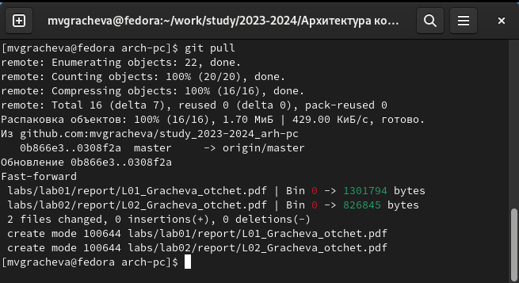
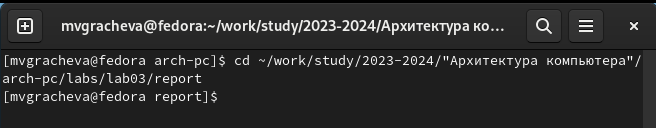

---
## Front matter
title: "Лабораторная работа №3"
subtitle: "Язык разметика Markdown"
author: "Мария Валерьевна Грачева"

## Generic otions
lang: ru-RU
toc-title: "Содержание"

## Bibliography
bibliography: bib/cite.bib
csl: pandoc/csl/gost-r-7-0-5-2008-numeric.csl

## Pdf output format
toc: true # Table of contents
toc-depth: 2
lof: true # List of figures
lot: true # List of tables
fontsize: 12pt
linestretch: 1.5
papersize: a4
documentclass: scrreprt
## I18n polyglossia
polyglossia-lang:
  name: russian
  options:
	- spelling=modern
	- babelshorthands=true
polyglossia-otherlangs:
  name: english
## I18n babel
babel-lang: russian
babel-otherlangs: english
## Fonts
mainfont: PT Serif
romanfont: PT Serif
sansfont: PT Sans
monofont: PT Mono
mainfontoptions: Ligatures=TeX
romanfontoptions: Ligatures=TeX
sansfontoptions: Ligatures=TeX,Scale=MatchLowercase
monofontoptions: Scale=MatchLowercase,Scale=0.9
## Biblatex
biblatex: true
biblio-style: "gost-numeric"
biblatexoptions:
  - parentracker=true
  - backend=biber
  - hyperref=auto
  - language=auto
  - autolang=other*
  - citestyle=gost-numeric
## Pandoc-crossref LaTeX customization
figureTitle: "Рис."
tableTitle: "Таблица"
listingTitle: "Листинг"
lofTitle: "Список иллюстраций"
lotTitle: "Список таблиц"
lolTitle: "Листинги"
## Misc options
indent: true
header-includes:
  - \usepackage{indentfirst}
  - \usepackage{float} # keep figures where there are in the text
  - \floatplacement{figure}{H} # keep figures where there are in the text
---

# Цель работы

Целью работы является освоение процедуры оформления отчетов с помощью легковесного
языка разметки Markdown.

# Задание

Выполнить лабораторную и самостоятельную работу

# Теоретическое введение

Чтобы создать заголовок, используем #. Для полужирного начертания записываем текст так `**текст**`, для курсивного `*текст*`, для полужирного и курсивного `***текст***`.
Блок цитирования создается с помощью символа >.

Создание списков:
Упорядоченный список оформляется с помощью цифр, неупорядоченный - с помощью звездочек или тире. Для дочернего списка сделать отступы.

Встроенная ссылка состоит из текста гиперссылки, который мы заключаем в квадратные скобки, и URL-фдреса или имени файла, на который дается ссылка. Его заключаем в круглые скобки.

# Выполнение лабораторной работы

Открывем терминал и переходим в каталог курса (рис. @fig:001).

{#fig:001 width=70%}

Обновляем каталог курса (рис. @fig:002).

{#fig:002 width=70%}

Переходим в каталог с шаблоном отчета по лабораторной работе № 3 (рис. @fig:003).

{#fig:003 width=70%}

Выполняем команду make (рис. @fig:004).

{#fig:004 width=70%}

Проверяем наличие файлов (рис. @fig:005)

{#fig:005 width=70%}

Удаляем файлы  (рис. @fig:006)

{#fig:006 width=70%}

# Выполнение самостоятельной работы

Результат самостоятельной работы - это отчёт лабораторной работы номер 2

# Выводы
Освоили процедуры оформления отчетов с помощью легковесного языка разметки Markdown. Научились оформлять отчёты в формате Markdown и генерировать их в формат pdf и docx.

# Список литературы{.unnumbered}

::: {#refs}
:::
