---
## Front matter
title: "Лабораторная работа №4"
subtitle: "Создание и процесс
обработки программ на языке ассемблера NASM"
author: "Мария Валерьевна Грачева"

## Generic otions
lang: ru-RU
toc-title: "Содержание"

## Bibliography
bibliography: bib/cite.bib
csl: pandoc/csl/gost-r-7-0-5-2008-numeric.csl

## Pdf output format
toc: true # Table of contents
toc-depth: 2
lof: true # List of figures
lot: true # List of tables
fontsize: 12pt
linestretch: 1.5
papersize: a4
documentclass: scrreprt
## I18n polyglossia
polyglossia-lang:
  name: russian
  options:
	- spelling=modern
	- babelshorthands=true
polyglossia-otherlangs:
  name: english
## I18n babel
babel-lang: russian
babel-otherlangs: english
## Fonts
mainfont: PT Serif
romanfont: PT Serif
sansfont: PT Sans
monofont: PT Mono
mainfontoptions: Ligatures=TeX
romanfontoptions: Ligatures=TeX
sansfontoptions: Ligatures=TeX,Scale=MatchLowercase
monofontoptions: Scale=MatchLowercase,Scale=0.9
## Biblatex
biblatex: true
biblio-style: "gost-numeric"
biblatexoptions:
  - parentracker=true
  - backend=biber
  - hyperref=auto
  - language=auto
  - autolang=other*
  - citestyle=gost-numeric
## Pandoc-crossref LaTeX customization
figureTitle: "Рис."
tableTitle: "Таблица"
listingTitle: "Листинг"
lofTitle: "Список иллюстраций"
lotTitle: "Список таблиц"
lolTitle: "Листинги"
## Misc options
indent: true
header-includes:
  - \usepackage{indentfirst}
  - \usepackage{float} # keep figures where there are in the text
  - \floatplacement{figure}{H} # keep figures where there are in the text
---

# Цель работы

Освоение процедуры компиляции и сборки программ, написанных на ассемблере NASM.

# Теоретическое введение

Основными функциональными элементами любой электронно-вычислительной машины
(ЭВМ) являются центральный процессор, память и периферийные устройства. В состав центрльного процессора входят: арифметико-логическое устройство, устройство управления, регистры.

На иллюстрации ниже приведена структурная схема ЭВМ (рис. @fig:001)

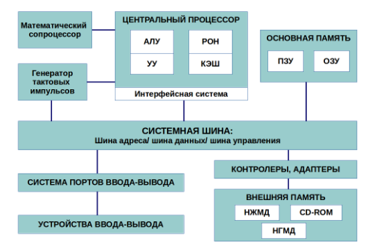{#fig:001 width=70%}

# Выполнение лабораторной работы

Создаем каталог lab04 (рис. @fig:002).

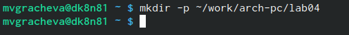{#fig:002 width=70%}

Переходим в этот каталог (рис. @fig:003)

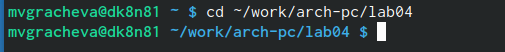{#fig:003 width=70%}

Создаём текстовый файл (рис. @fig:004)

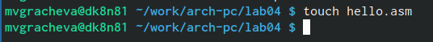{#fig:004 width=70%}

Превращем текст в объектный код (рис. @fig:005)

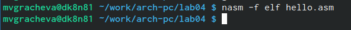{#fig:005 width=70%}

Проверяем наличие нового файла (рис. @fig:006)

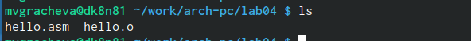{#fig:006 width=70%}

Выполняем расширенную команду NASM (рис. @fig:007)

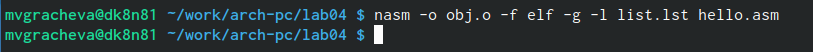{#fig:007 width=70%}

Проверяем наличие нового файла (рис. @fig:008)

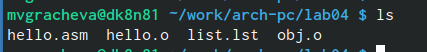{#fig:008 width=70%}

Передаём файл на компоновку (рис. @fig:009)

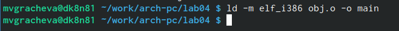{#fig:009 width=70%}

Передаём файл снова на компоновку (рис. @fig:010)

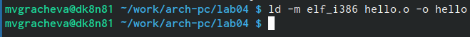{#fig:010 width=70%}

Запускаем файл hello (рис. @fig:011)

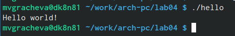{#fig:011 width=70%}

# Выполнение самостоятельной работы

Создаём копию файла с новым названием (рис. @fig:012), (рис. @fig:013)

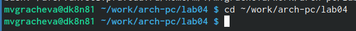{#fig:012 width=70%}

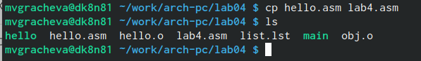{#fig:013 width=70%}

Вносим изменения текста в файле (рис. @fig:014)

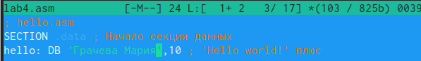{#fig:014 width=70%}

Транслируем текст в объектный файл и выполняем компоновку объектного файла (рис. @fig:015), (рис. @fig:016)

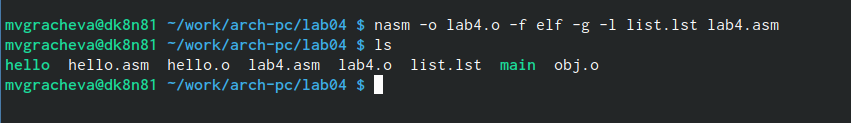{#fig:015 width=70%}

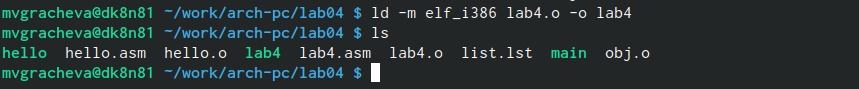{#fig:016 width=70%}

Запускаем наш файл (рис. @fig:017)

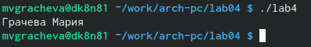{#fig:017 width=70%}

Копируем наши файлы в другой каталог (рис. @fig:018)

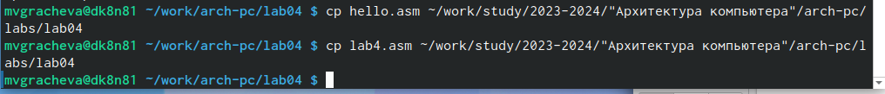{#fig:018 width=70%}

# Выводы

Сегодня я освоила процедуры компиляции и сборки программ, написанных на ассемблере NASM.

# Список литературы{.unnumbered}

::: {#refs}
:::
