---
## Front matter
title: "Отчёт по лабораторной работе №6"
subtitle: "Арифметические операции в NASM."
author: "Грачева Мария Валерьевна"

## Generic otions
lang: ru-RU
toc-title: "Содержание"

## Bibliography
bibliography: bib/cite.bib
csl: pandoc/csl/gost-r-7-0-5-2008-numeric.csl

## Pdf output format
toc: true # Table of contents
toc-depth: 2
lof: true # List of figures
lot: true # List of tables
fontsize: 12pt
linestretch: 1.5
papersize: a4
documentclass: scrreprt
## I18n polyglossia
polyglossia-lang:
  name: russian
  options:
	- spelling=modern
	- babelshorthands=true
polyglossia-otherlangs:
  name: english
## I18n babel
babel-lang: russian
babel-otherlangs: english
## Fonts
mainfont: PT Serif
romanfont: PT Serif
sansfont: PT Sans
monofont: PT Mono
mainfontoptions: Ligatures=TeX
romanfontoptions: Ligatures=TeX
sansfontoptions: Ligatures=TeX,Scale=MatchLowercase
monofontoptions: Scale=MatchLowercase,Scale=0.9
## Biblatex
biblatex: true
biblio-style: "gost-numeric"
biblatexoptions:
  - parentracker=true
  - backend=biber
  - hyperref=auto
  - language=auto
  - autolang=other*
  - citestyle=gost-numeric
## Pandoc-crossref LaTeX customization
figureTitle: "Рис."
tableTitle: "Таблица"
listingTitle: "Листинг"
lofTitle: "Список иллюстраций"
lotTitle: "Список таблиц"
lolTitle: "Листинги"
## Misc options
indent: true
header-includes:
  - \usepackage{indentfirst}
  - \usepackage{float} # keep figures where there are in the text
  - \floatplacement{figure}{H} # keep figures where there are in the text
---

# Цель работы

Освоение арифметических инструкций языка ассемблера NASM

# Теоретическое введение

Большинство инструкций на языке ассемблера требуют обработки операндов. Адрес операнда предоставляет место, где хранятся данные, подлежащие обработке. Это могут быть данные хранящиеся в регистре или в ячейке памяти. Далее рассмотрены все существующие способы задания адреса хранения операндов – способы адресации.

Существует три основных способа адресации:

• *Регистровая адресация* – операнды хранятся в регистрах и в команде используются
имена этих регистров, например: mov ax,bx.
• *Непосредственная адресация* – значение операнда задается непосредственно в ко-
манде, Например: mov ax,2.
• *Адресация памяти* – операнд задает адрес в памяти. В команде указывается символи-
ческое обозначение ячейки памяти, над содержимым которой требуется выполнить
операцию.

**Арифметические операции в NASM**

Сложение - add
Вычитание - sub
Умножение - mul
Деление - div

Для выполнения лабораторных работ в файле in_out.asm реализованы подпрограммы
для преобразования ASCII символов в числа и обратно. Это:
• *iprint* – вывод на экран чисел в формате ASCII, перед вызовом iprint в регистр eax
необходимо записать выводимое число (mov eax,<int>).
• *iprintLF* – работает аналогично iprint, но при выводе на экран после числа добавляет
к символ перевода строки.
• *atoi* – функция преобразует ascii-код символа в целое число и записает результат
в регистр eax, перед вызовом atoi в регистр eax необходимо записать число (mov
eax,<int>).

# Выполнение лабораторной работы

Создаю каталог для программам лабораторной работы № 6, перехожу в него и создаю файл lab6-1.asm(рис. @fig:001).

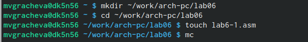{#fig:001 width=70%}

Ввожу текст для программы вывода значения регистра eax(рис. @fig:002).

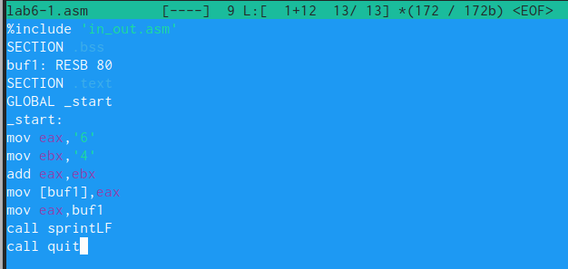{#fig:002 width=70%}

Создаю исполняемый файл и запускаю его (рис. @fig:003), (рис. @fig:004).

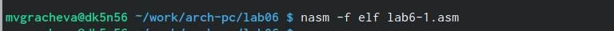{#fig:003 width=70%}

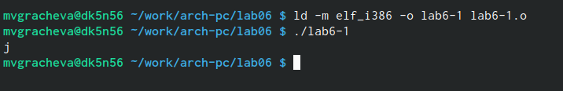{#fig:004 width=70%}

Заменяю текст программы (рис. @fig:005), должны получить символ 49-1 48-0, то есть 4948, но в итоге ничего не вывелось (рис. @fig:006).

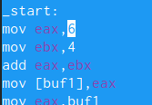{#fig:005 width=70%}

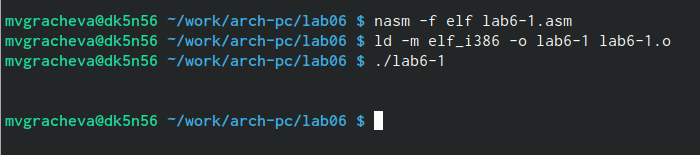{#fig:006 width=70%}

Создаю файл lab06-2 (рис. @fig:007), ввожу в неё программу (рис. @fig:008), создаю исполняемый файл и проверяю работу (рис. @fig:009).

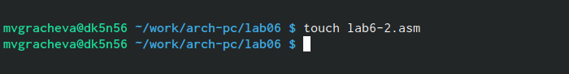{#fig:007 width=70%}

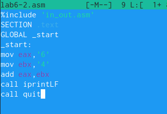{#fig:008 width=70%}

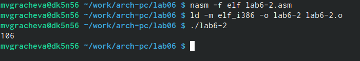{#fig:009 width=70%}

Меняю символы на числа (рис. @fig:010).

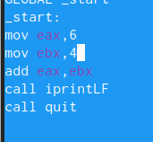{#fig:010 width=70%}

Создаю исполняемый файл. Получаем 10, программа работает верно! (рис. @fig:011).

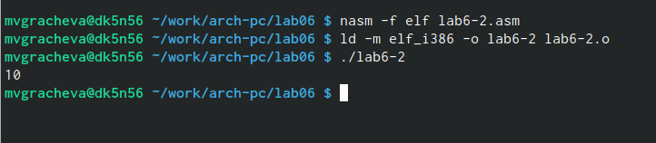{#fig:011 width=70%}

Заменияю iprintLF на iprint(рис. @fig:012), создаю исполянемый файл и проверяю работу. Отличие заключается в том, что нет перехода на новую строку после завершения программы (рис. @fig:013).

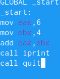{#fig:012 width=70%}

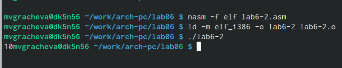{#fig:013 width=70%}

Создаю файл lab6-3.asm (рис. @fig:014), ввожу текст и проверяю работу (рис. @fig:015).

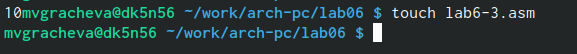{#fig:014 width=70%}

{#fig:015 width=70%}

Изменяю текст программы для вычисления выражения 𝑓(𝑥) = (4 ∗ 6 + 2)/5 (рис. @fig:016). Создаю исполняемый файл и проверяю его работу (рис. @fig:017).

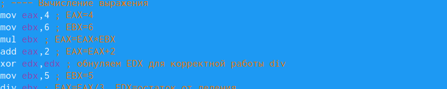{#fig:016 width=70%}

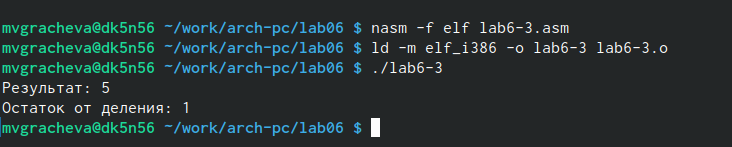{#fig:017 width=70%}

Создаю файл (рис. @fig:018), ввожу текст программы (рис. @fig:020), проверяю работу. Получился 16 вариант (рис. @fig:019).

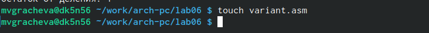{#fig:018 width=70%}

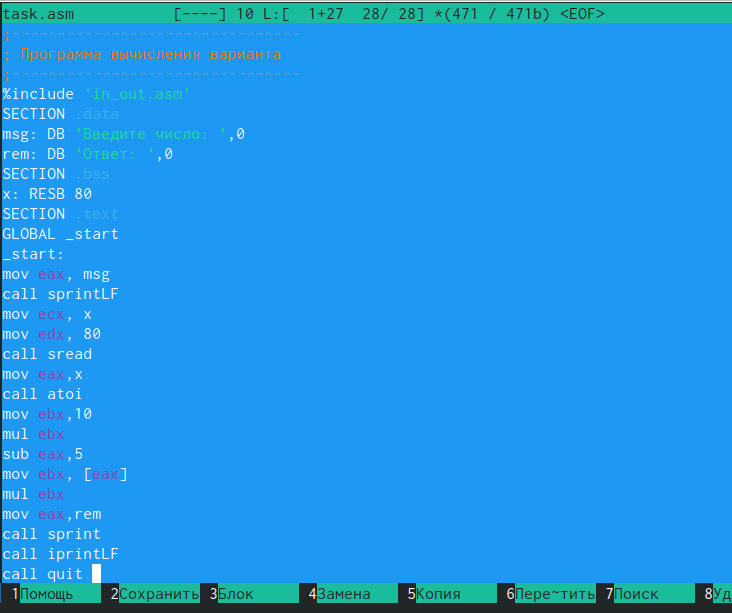{#fig:020 width=70%}

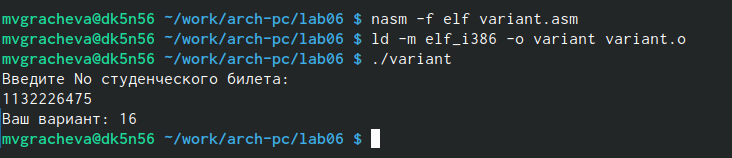{#fig:019 width=70%}

# Ответы на вопросы

1. Какие строки листинга 6.4 отвечают за вывод на экран сообщения ‘Ваш вариант:’?

msg: DB 'Введите No студенческого билета: ',0 

и

mov eax, msg
call sprintLF

2. Для чего используется следующие инструкции?
mov ecx, x
mov edx, 80
call sread

Для того, чтобы прочитать то значение х, которое ввёл пользователь

3. Для чего используется инструкция “call atoi”?

Для преобразования ASCII кода в число

4. Какие строки листинга 6.4 отвечают за вычисления варианта?

xor edx,edx
mov ebx,20
div ebx
inc edx

5. В какой регистр записывается остаток от деления при выполнении инструкции “div ebx”?

edx

6. Для чего используется инструкция “inc edx”?

Для того, чтобы занести в регистр edx остаток от деления

7. Какие строки листинга 6.4 отвечают за вывод на экран результата вычислений?

rem: DB 'Ваш вариант: ',0

и

mov eax,rem
call sprint
mov eax,edx
call iprintLF

# Самостоятельная работа

Создаю файл task.asm (рис. @fig:021), ввожу программу (рис. @fig:022), ввожу первое значение - 3 (рис. @fig:023), ввожу второе значение - 1 (рис. @fig:024).

{#fig:021 width=70%}

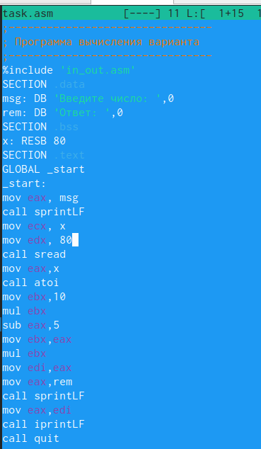{#fig:022 width=70%}

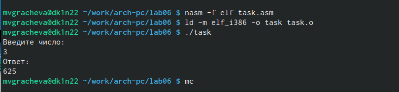{#fig:023 width=70%}

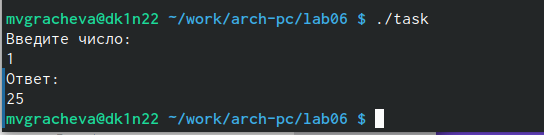{#fig:024 width=70%}

# Выводы

Освоила арифметические инструкции языка ассемблера NASM

# Список литературы{.unnumbered}

::: {#refs}
:::
