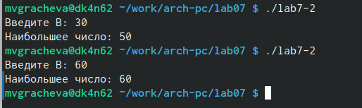

---
## Front matter
title: "Отчёт по лабораторной работе №7"
subtitle: " Команды безусловного и условного переходов в Nasm. Программирование ветвлений."
author: "Мария Валерьевна Грачева"

## Generic otions
lang: ru-RU
toc-title: "Содержание"

## Bibliography
bibliography: bib/cite.bib
csl: pandoc/csl/gost-r-7-0-5-2008-numeric.csl

## Pdf output format
toc: true # Table of contents
toc-depth: 2
lof: true # List of figures
lot: true # List of tables
fontsize: 12pt
linestretch: 1.5
papersize: a4
documentclass: scrreprt
## I18n polyglossia
polyglossia-lang:
  name: russian
  options:
	- spelling=modern
	- babelshorthands=true
polyglossia-otherlangs:
  name: english
## I18n babel
babel-lang: russian
babel-otherlangs: english
## Fonts
mainfont: PT Serif
romanfont: PT Serif
sansfont: PT Sans
monofont: PT Mono
mainfontoptions: Ligatures=TeX
romanfontoptions: Ligatures=TeX
sansfontoptions: Ligatures=TeX,Scale=MatchLowercase
monofontoptions: Scale=MatchLowercase,Scale=0.9
## Biblatex
biblatex: true
biblio-style: "gost-numeric"
biblatexoptions:
  - parentracker=true
  - backend=biber
  - hyperref=auto
  - language=auto
  - autolang=other*
  - citestyle=gost-numeric
## Pandoc-crossref LaTeX customization
figureTitle: "Рис."
tableTitle: "Таблица"
listingTitle: "Листинг"
lofTitle: "Список иллюстраций"
lotTitle: "Список таблиц"
lolTitle: "Листинги"
## Misc options
indent: true
header-includes:
  - \usepackage{indentfirst}
  - \usepackage{float} # keep figures where there are in the text
  - \floatplacement{figure}{H} # keep figures where there are in the text
---

# Цель работы

Изучение команд условного и безусловного переходов. Приобретение навыков написания программ с использованием переходов. Знакомство с назначением и структурой файла листинга.

# Теоретическое введение

Для реализации ветвлений в ассемблере используются так называемые команды передачи управления или команды перехода. Можно выделить 2 типа переходов:
• условный переход – выполнение или не выполнение перехода в определенную точку программы в зависимости от проверки условия.
• безусловный переход – выполнение передачи управления в определенную точку программы без каких-либо условий.

Флаг – это бит, принимающий значение 1 («флаг установлен»), если выполнено некоторое условие, и значение 0 («флаг сброшен») в противном случае. Флаги работают независимо друг от друга, и лишь для удобства они помещены в единый регистр — регистр флагов, отражающий текущее состояние процессора.

Инструкция cmp является одной из инструкций, которая позволяет сравнить операнды и выставляет флаги в зависимости от результата сравнения. Инструкция cmp является командой сравнения двух операндов и имеет такой же формат, как и команда вычитания:
cmp <операнд_1>, <операнд_2>

Команда условного перехода имеет вид
j<мнемоника перехода> label
Мнемоника перехода связана со значением анализируемых флагов или со способом формирования этих флагов.

Листинг (в рамках понятийного аппарата NASM) — это один из выходных файлов, создаваемых транслятором. Он имеет текстовый вид и нужен при отладке программы, так как кроме строк самой программы он содержит дополнительную информацию.

# Выполнение лабораторной работы

Создаю каталог для программам лабораторной работы No 7, перехожу в него и создаю файл lab7-1.asm (рис. @fig:001).

{#fig:001 width=70%}

Ввожу листинг программы (рис. @fig:002).

{#fig:002 width=70%}

Запускаю файл (рис. @fig:003).

{#fig:003 width=70%}

Меняю текст программы(рис. @fig:004).

{#fig:004 width=70%}

Запускаю файл(рис. @fig:005).

{#fig:005 width=70%}

Меняю текст программы, чтобы выходило 3, 2, 1(рис. @fig:006).

{#fig:006 width=70%}

Запускаю файл(рис. @fig:007).

{#fig:007 width=70%}

Создаю файл lab7-2.asm в каталоге ~/work/arch-pc/lab07. (рис. @fig:008).

{#fig:008 width=70%}

Листинг программы 2(рис. @fig:009).

{#fig:009 width=70%}

Проверяю работу файла (рис. @fig:010), (рис. @fig:011).

{#fig:010 width=70%}

{#fig:011 width=70%}

Создаю файл листинга для программы из файла lab7-2.asm. Открываю файл листинга lab7-2.lst с помощью mcedit: (рис. @fig:012).

{#fig:012 width=70%}

Открываем файл (рис. @fig:013).

{#fig:013 width=70%}

Первая строка это использование другого файла, чтобы не рассписывать каждый раз программы

11 строка это переход на метку nextchar

22 строка для того, чтобы вывести сообщение

# Выполнение самостоятельной работы

Создаю файл (рис. @fig:014), ввожу текст (рис. @fig:015), проверяю работу файла (рис. @fig:016).

{#fig:014 width=70%}

{#fig:015 width=70%}

{#fig:016 width=70%}

Задание 2

Код программы  (рис. @fig:017), (рис. @fig:018).

{#fig:017 width=70%}

{#fig:018 width=70%}

Проверка работы файла (рис. @fig:019), (рис. @fig:020).

{#fig:019 width=70%}

{#fig:020 width=70%}

# Выводы

Изучила команды условного и безусловного переходов. Приобрела навыков написания программ с использованием переходов. Ознакомилась с назначением и структурой файла листинга. 

# Список литературы{.unnumbered}

::: {#refs}
:::
