---
## Front matter
title: "Отчёт по лабораторной работе №8"
subtitle: "Программирование цикла. Обработка аргументов командной строки"
author: "Грачева Мария Валерьевна"

## Generic otions
lang: ru-RU
toc-title: "Содержание"

## Bibliography
bibliography: bib/cite.bib
csl: pandoc/csl/gost-r-7-0-5-2008-numeric.csl

## Pdf output format
toc: true # Table of contents
toc-depth: 2
lof: true # List of figures
lot: true # List of tables
fontsize: 12pt
linestretch: 1.5
papersize: a4
documentclass: scrreprt
## I18n polyglossia
polyglossia-lang:
  name: russian
  options:
	- spelling=modern
	- babelshorthands=true
polyglossia-otherlangs:
  name: english
## I18n babel
babel-lang: russian
babel-otherlangs: english
## Fonts
mainfont: PT Serif
romanfont: PT Serif
sansfont: PT Sans
monofont: PT Mono
mainfontoptions: Ligatures=TeX
romanfontoptions: Ligatures=TeX
sansfontoptions: Ligatures=TeX,Scale=MatchLowercase
monofontoptions: Scale=MatchLowercase,Scale=0.9
## Biblatex
biblatex: true
biblio-style: "gost-numeric"
biblatexoptions:
  - parentracker=true
  - backend=biber
  - hyperref=auto
  - language=auto
  - autolang=other*
  - citestyle=gost-numeric
## Pandoc-crossref LaTeX customization
figureTitle: "Рис."
tableTitle: "Таблица"
listingTitle: "Листинг"
lofTitle: "Список иллюстраций"
lotTitle: "Список таблиц"
lolTitle: "Листинги"
## Misc options
indent: true
header-includes:
  - \usepackage{indentfirst}
  - \usepackage{float} # keep figures where there are in the text
  - \floatplacement{figure}{H} # keep figures where there are in the text
---

# Цель работы

Приобретение навыков написания программ с использованием циклов и обработкой аргументов командной строки.

# Теоретическое введение

Стек — структура данных, представляющая из себя упорядоченный набор элементов, в которой добавление новых элементов и удаление существующих производится с одного конца, называемого вершиной стека.

Для стека существует две основные операции:
• добавление элемента в вершину стека (push);
• извлечение элемента из вершины стека (pop)

Организация стека в процессоре (рис. @fig:001).

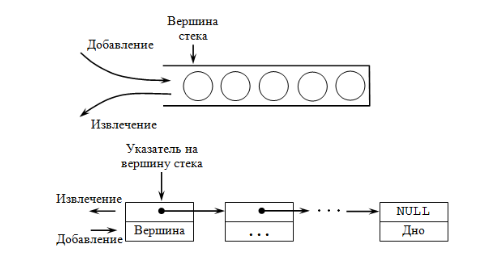{#fig:001 width=70%}

Для организации циклов существуют специальные инструкции. Для всех инструкций
максимальное количество проходов задаётся в регистре ecx. Наиболее простой является ин-
струкция loop. Она позволяет организовать безусловный цикл.

Иструкция loop выполняется в два этапа. Сначала из регистра ecx вычитается единица и
его значение сравнивается с нулём. Если регистр не равен нулю, то выполняется переход к
указанной метке. Иначе переход не выполняется и управление передаётся команде, которая
следует сразу после команды loop.

# Выполнение лабораторной работы

Создаю каталог для программам лабораторной работы No 8, перехожу в него и создаю файл lab8-1.asm (рис. @fig:002).

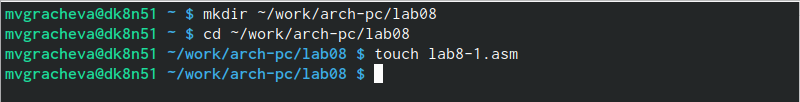{#fig:002 width=70%}

Ввожу в файл lab8-1.asm текст программы из листинга (рис. @fig:003).

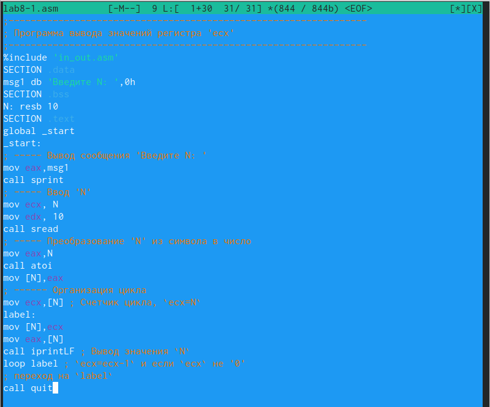{#fig:003 width=70%}

Проверю работу файла(рис. @fig:004).

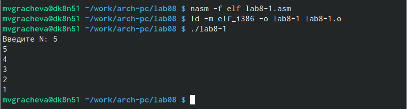{#fig:004 width=70%}

Изменяю текст программы, добавив изменение значение регистра ecx в цикле:(рис. @fig:005).

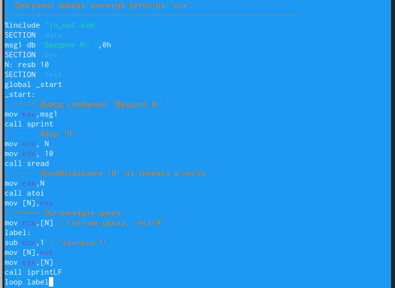{#fig:005 width=70%}

Проверяю работу файла. Мы видим, что значения получается через единицу. Получается не N, a N/2 (рис. @fig:006).

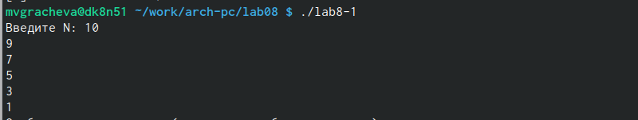{#fig:006 width=70%}

Опять вносим изменения в программу (рис. @fig:007).

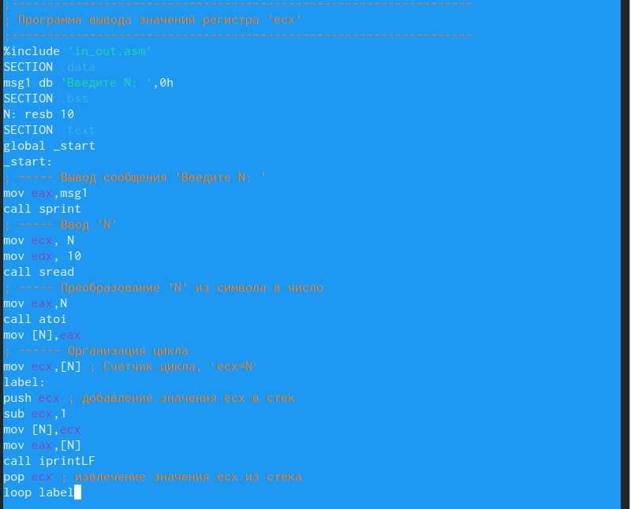{#fig:007 width=70%}

Теперь программа работает корректно (рис. @fig:008).

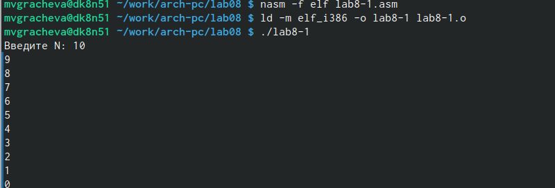{#fig:008 width=70%}

Создаю новый файл (рис. @fig:009), ввожу текст (рис. @fig:010), создаю исполняемый файл(рис. @fig:011)

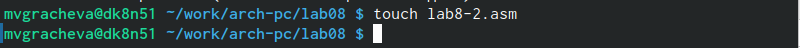{#fig:009 width=70%}

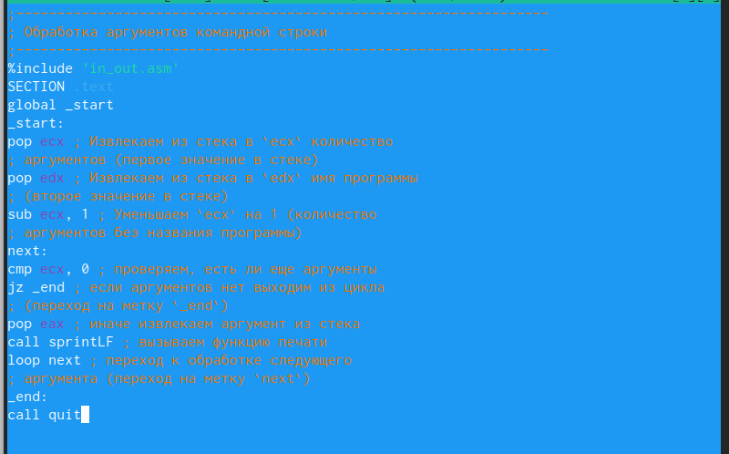{#fig:010 width=70%}

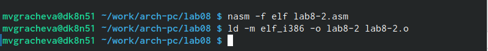{#fig:011 width=70%}

Запускаю его, указав аргументы. Обработано было 4 аргумента (рис. @fig:012).

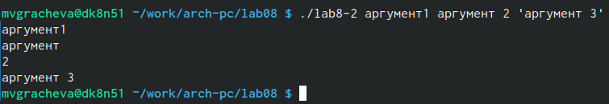{#fig:012 width=70%}

Создаю новый файл (рис. @fig:013), ввожу в него текст (рис. @fig:014)

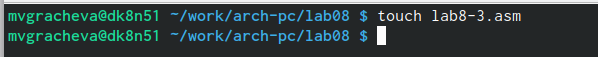{#fig:013 width=70%}

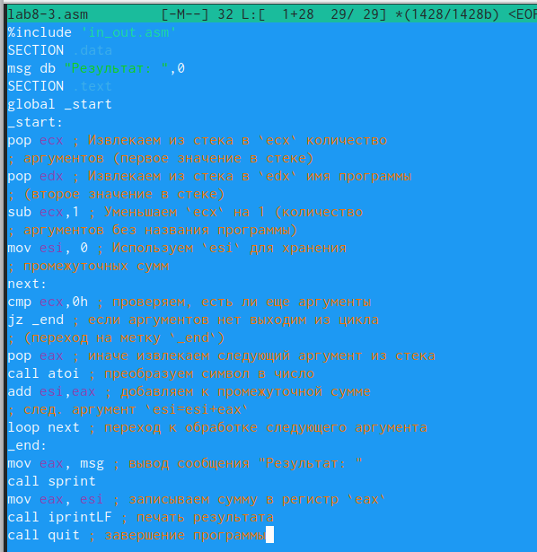{#fig:014 width=70%}

 

Cоздаю исполняемый файл (рис. @fig:015), провверяю его работу (рис. @fig:016)

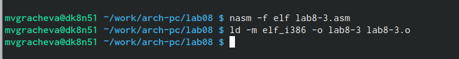{#fig:015 width=70%}

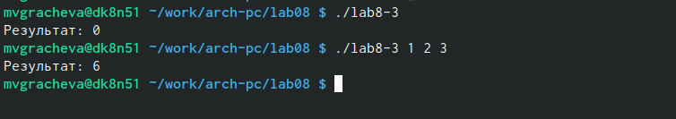{#fig:016 width=70%}

Изменяю программу, чтобы значения умножались (рис. @fig:017), проверяю работу файла (рис. @fig:018).

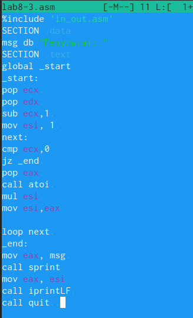{#fig:017 width=70%}

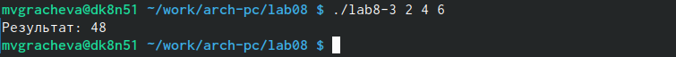{#fig:018 width=70%}

# Cамостоятельная работа

Результатом самостоятельной работы является файл task.asm

Текст программы (рис. @fig:019).

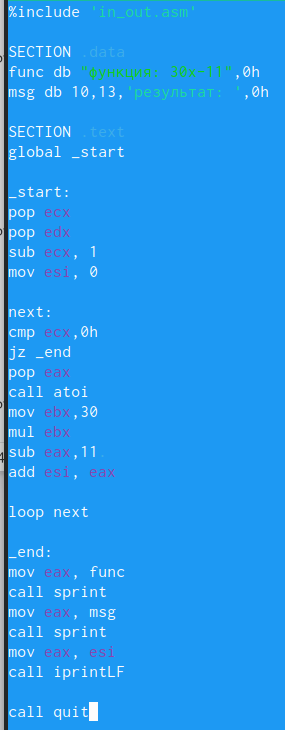{#fig:019 width=70%}

Проверка работы программы (рис. @fig:020), (рис. @fig:021).

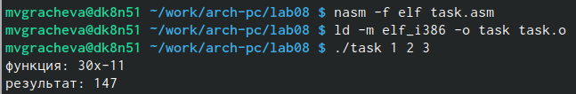{#fig:020 width=70%}

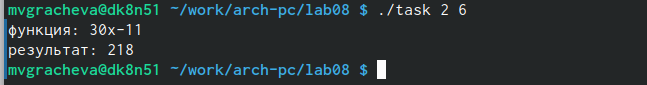{#fig:021 width=70%}

# Выводы

Приобрела навыки написания программ с использованием циклов и обработкой аргументов командной строки.

# Список литературы{.unnumbered}

::: {#refs}
:::
