---
## Front matter
title: "Отчёт по лабораторной работе №9"
subtitle: "Понятие подпрограммы. Отладчик GDB"
author: "Грачева Мария Валерьевна"

## Generic otions
lang: ru-RU
toc-title: "Содержание"

## Bibliography
bibliography: bib/cite.bib
csl: pandoc/csl/gost-r-7-0-5-2008-numeric.csl

## Pdf output format
toc: true # Table of contents
toc-depth: 2
lof: true # List of figures
lot: true # List of tables
fontsize: 12pt
linestretch: 1.5
papersize: a4
documentclass: scrreprt
## I18n polyglossia
polyglossia-lang:
  name: russian
  options:
	- spelling=modern
	- babelshorthands=true
polyglossia-otherlangs:
  name: english
## I18n babel
babel-lang: russian
babel-otherlangs: english
## Fonts
mainfont: PT Serif
romanfont: PT Serif
sansfont: PT Sans
monofont: PT Mono
mainfontoptions: Ligatures=TeX
romanfontoptions: Ligatures=TeX
sansfontoptions: Ligatures=TeX,Scale=MatchLowercase
monofontoptions: Scale=MatchLowercase,Scale=0.9
## Biblatex
biblatex: true
biblio-style: "gost-numeric"
biblatexoptions:
  - parentracker=true
  - backend=biber
  - hyperref=auto
  - language=auto
  - autolang=other*
  - citestyle=gost-numeric
## Pandoc-crossref LaTeX customization
figureTitle: "Рис."
tableTitle: "Таблица"
listingTitle: "Листинг"
lofTitle: "Список иллюстраций"
lotTitle: "Список таблиц"
lolTitle: "Листинги"
## Misc options
indent: true
header-includes:
  - \usepackage{indentfirst}
  - \usepackage{float} # keep figures where there are in the text
  - \floatplacement{figure}{H} # keep figures where there are in the text
---

# Цель работы

Приобретение навыков написания программ с использованием подпрограмм. Знакомство с методами отладки при помощи GDB и его основными возможностями

# Теоретическое введение

Отладка — это процесс поиска и исправления ошибок в программе. В общем случае его можно разделить на четыре этапа:
• обнаружение ошибки;
• поиск её местонахождения;
• определение причины ошибки;
• исправление ошибки

Наиболее часто применяют следующие методы отладки:
• создание точек контроля значений на входе и выходе участка программы (например, вывод промежуточных значений на экран — так называемые диагностические сообщения);
• использование специальных программ-отладчиков.

GDB (GNU Debugger — отладчик проекта GNU) работает на многих UNIX-подобных системах и умеет производить отладку многих языков программирования. GDB предлагает обширные средства для слежения и контроля за выполнением компьютерных программ. 

Установить точку останова можно командой break (кратко b). Типичный аргумент этой команды — место установки.

Информацию о всех установленных точках останова можно вывести командой info 

Для того чтобы сделать неактивной какую-нибудь ненужную точку останова, можно воспользоваться командой disable

Обратно точка останова активируется командой enable

*Подпрограмма* — это, как правило, функционально законченный участок кода, который
можно многократно вызывать из разных мест программы. В отличие от простых переходов
из подпрограмм существует возврат на команду, следующую за вызовом.

# Выполнение лабораторной работы

Создаю каталог и файл lab09-1 (рис. @fig:001).

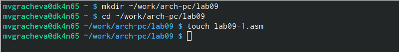{#fig:001 width=70%}

Ввожу программу (рис. @fig:001).

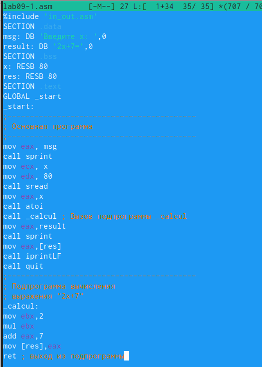{#fig:001 width=70%}

Проверяю работу файла (рис. @fig:001).

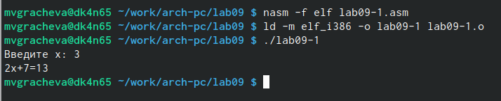{#fig:001 width=70%}

Изменяю текст программы, добавив подпрограмму _subcalcul в подпрограмму _calcul, для вычисления выражения 𝑓(𝑔(𝑥)), где 𝑥 вводится с клавиатуры, 𝑓(𝑥) = 2𝑥 + 7, 𝑔(𝑥) = 3𝑥 − 1. (рис. @fig:001)

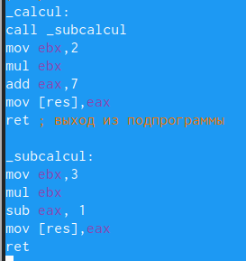{#fig:001 width=70%}

Проверяю его работу (рис. @fig:001).

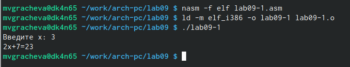{#fig:001 width=70%}

Создаю файл lab09-2 (рис. @fig:001).

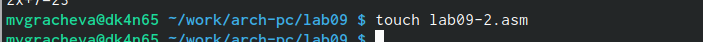{#fig:001 width=70%}

Ввожу текст программы (рис. @fig:001).

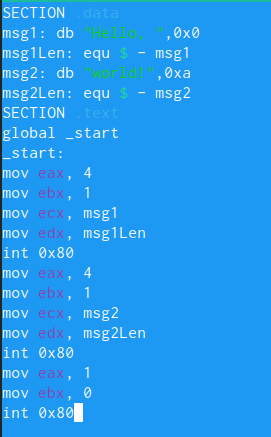{#fig:001 width=70%}

Создаю исполняемый файл (рис. @fig:001).

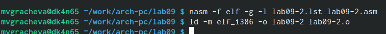{#fig:001 width=70%}

Загружаю исполняемый файл в отладчик gdb (рис. @fig:001).

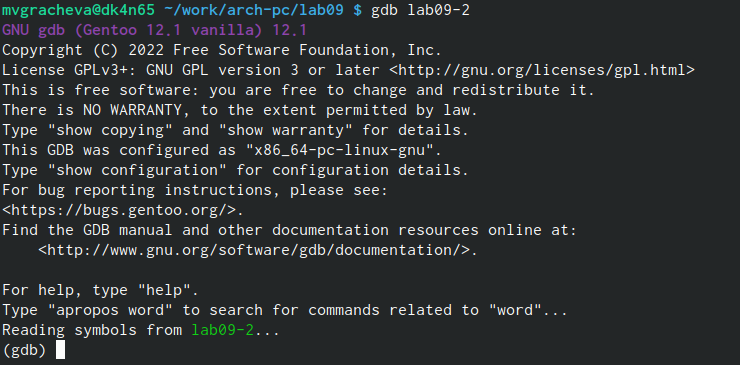{#fig:001 width=70%}

Проверяю работу программы (рис. @fig:001).

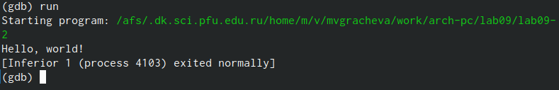{#fig:001 width=70%}

Устанавливаю брейкпоинт на метку _start (рис. @fig:001).

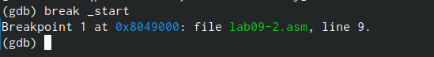{#fig:001 width=70%}

Запускаю (рис. @fig:001).

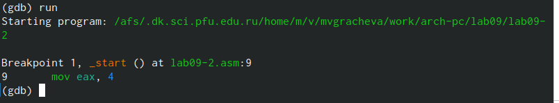{#fig:001 width=70%}

Смотрю дисассимилированный код программы(рис. @fig:001).

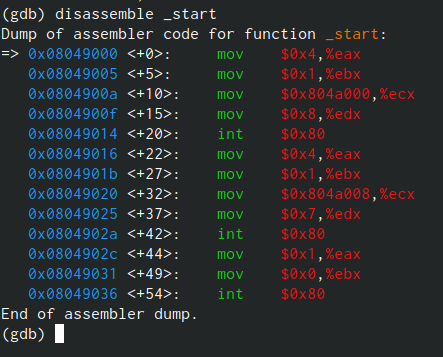{#fig:001 width=70%}

Переключаюсь на отображение команд с Intel’овским синтаксисом  (рис. @fig:001).

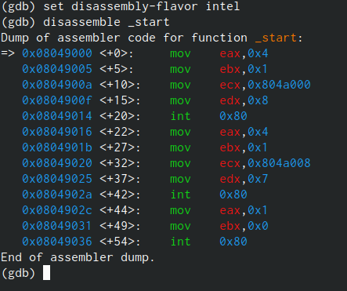{#fig:001 width=70%}

Включаю режим псевдографики для более удобного анализа программы (рис. @fig:001), (рис. @fig:001).

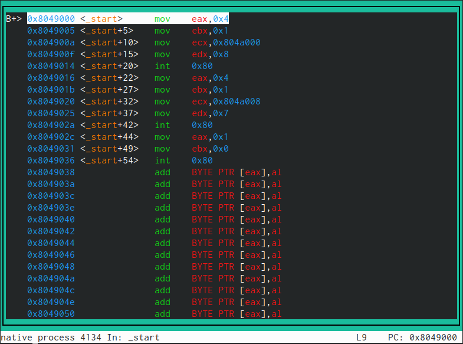{#fig:001 width=70%}

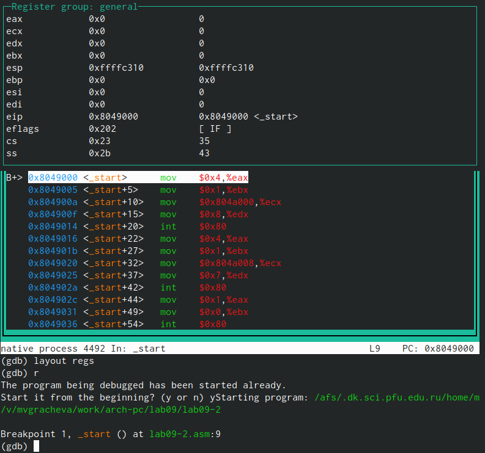{#fig:001 width=70%}

Ввожу команду info breakpoints (рис. @fig:001).

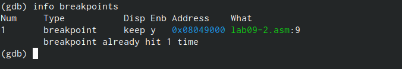{#fig:001 width=70%}

Устанавливаю новую точку останова (рис. @fig:001), (рис. @fig:001).

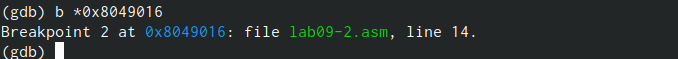{#fig:001 width=70%}

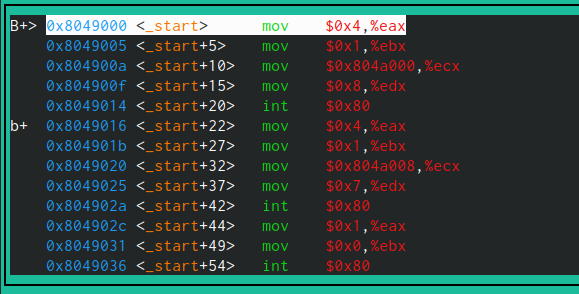{#fig:001 width=70%}

Смотрю инфу про все установленные точки (рис. @fig:001).

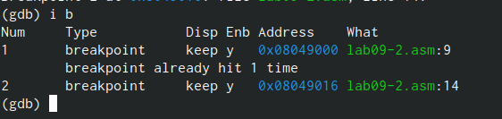{#fig:001 width=70%}

Выполняю пять раз комнду si (рис. @fig:001), (рис. @fig:001), (рис. @fig:001), (рис. @fig:001), (рис. @fig:001).

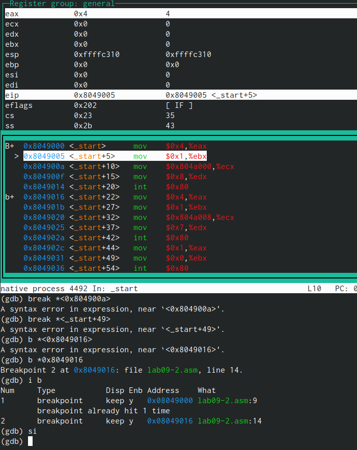{#fig:001 width=70%}

{#fig:001 width=70%}

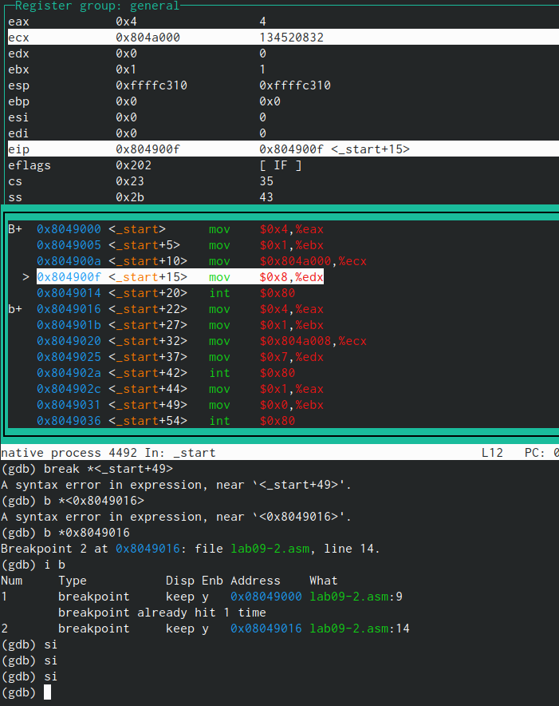{#fig:001 width=70%}

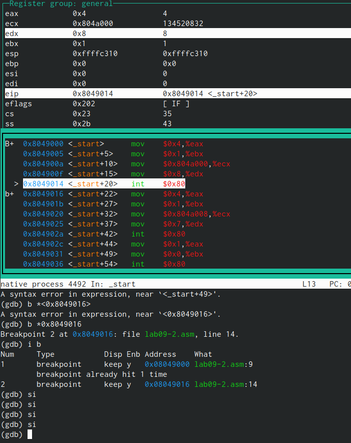{#fig:001 width=70%}

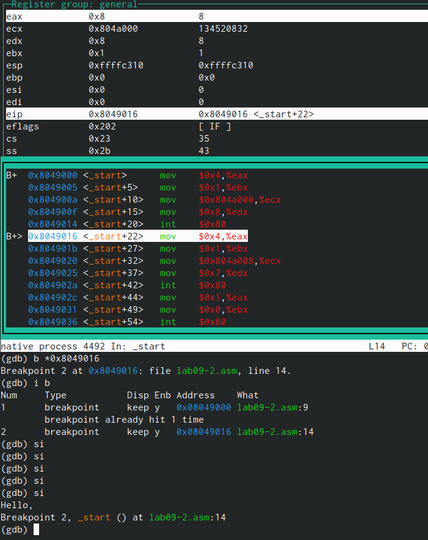{#fig:001 width=70%}

Смотрю содержимое регистров с помощью команды info registers (рис. @fig:001).

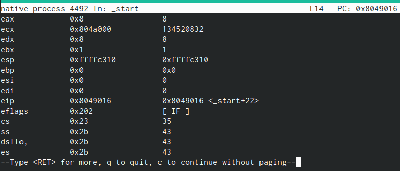{#fig:001 width=70%}

Смотрю значение переменной msg1 по имени(рис. @fig:001).

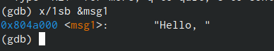{#fig:001 width=70%}

Смотрю значение переменной msg2 по адресу (рис. @fig:001).

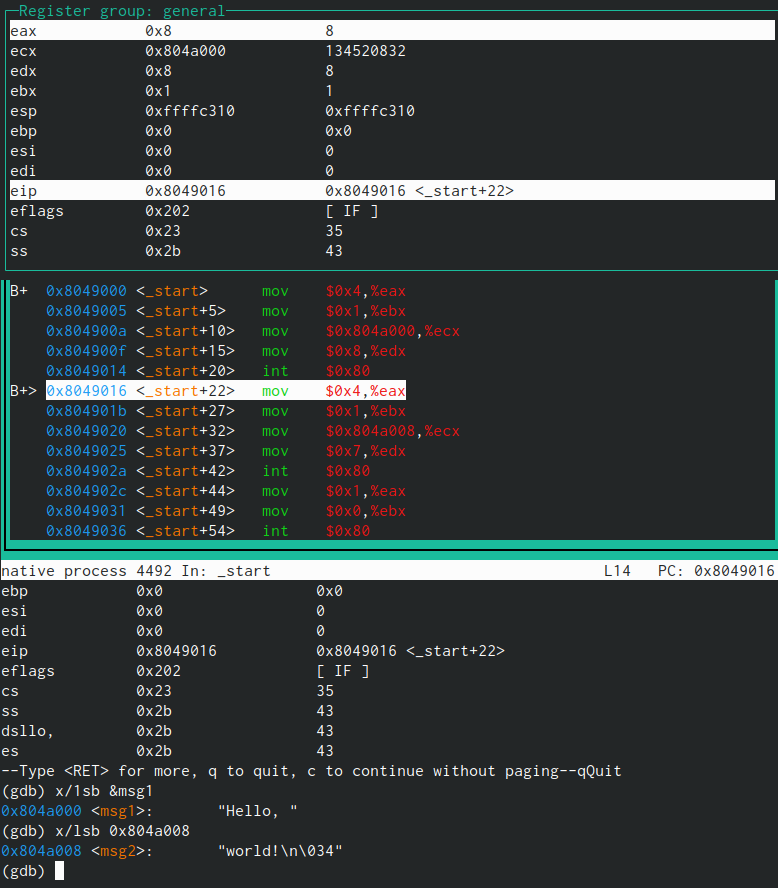{#fig:001 width=70%}

Заменяю первый (рис. @fig:001) и второй символы в первой переменной (рис. @fig:001).

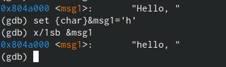{#fig:001 width=70%}

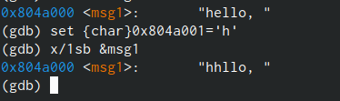{#fig:001 width=70%}

Заменяю первый символ во второй переменной(рис. @fig:001)

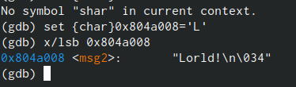{#fig:001 width=70%}

С помощью команды set изменяю значение регистра ebx (рис. @fig:001).

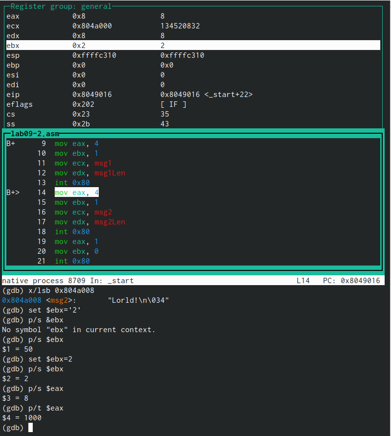{#fig:001 width=70%}

Завершаю выполнение программы с помощью команды si (рис. @fig:001).

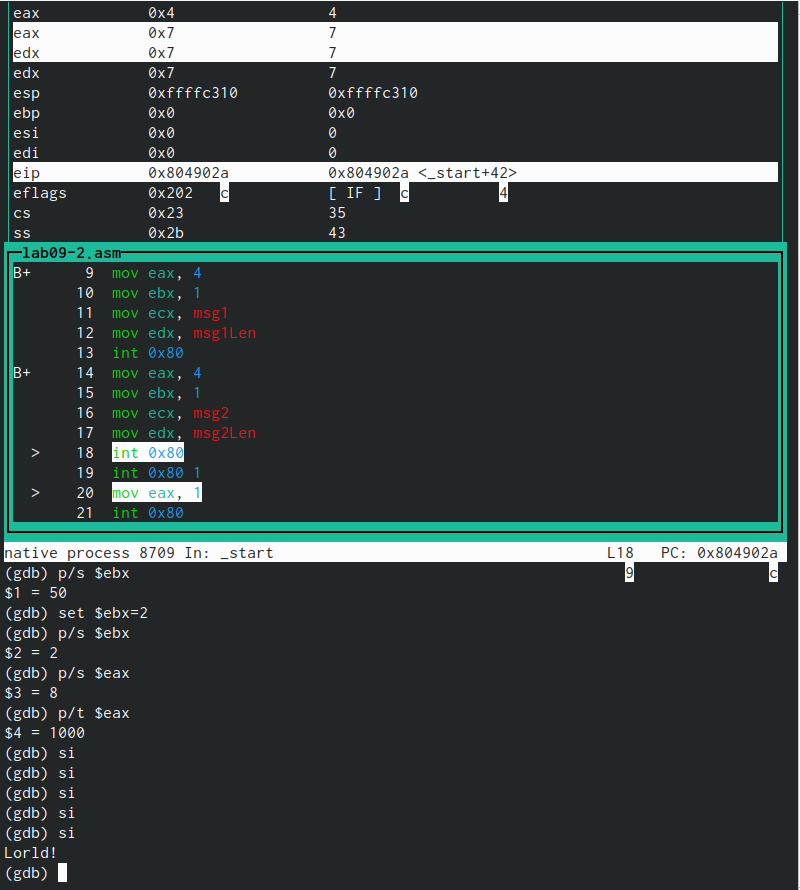{#fig:001 width=70%}

Скопировала файл lab8-2.asm, созданный при выполнении лабораторной работы No8, с программой выводящей на экран аргументы командной строки (Листинг 8.2) в файл с именем lab09-3.asm(рис. @fig:001).

{#fig:001 width=70%}

Создаю исполняемый файл (рис. @fig:001).

{#fig:001 width=70%}

Загружаю исполняемый файл в отладчик, указав аргументы(рис. @fig:001).

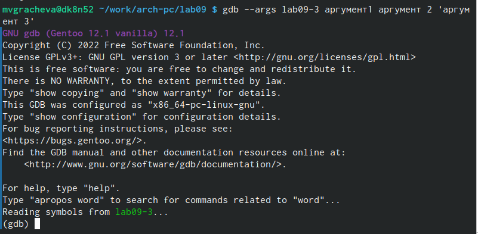{#fig:001 width=70%}

Устанавливаю точку останова (рис. @fig:001) и запускаю файл (рис. @fig:001).

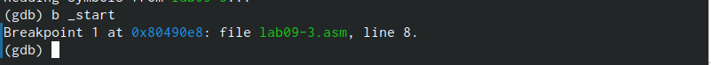{#fig:001 width=70%}

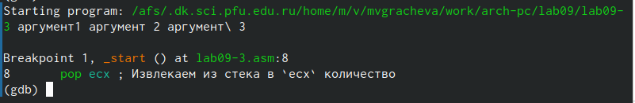{#fig:001 width=70%}

Адрес вершины стека храниться в регистре esp и по этому адресу располагается число равное количеству аргументов командной строки (включая имя программы)(рис. @fig:001).

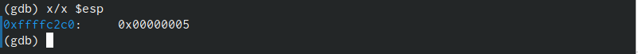{#fig:001 width=70%}

Смотрю остальные позиции стека (рис. @fig:001), (рис. @fig:001), (рис. @fig:001), (рис. @fig:001), (рис. @fig:001), (рис. @fig:001).

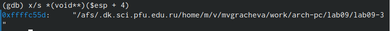{#fig:001 width=70%}

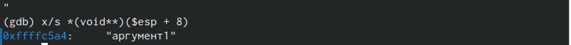{#fig:001 width=70%}

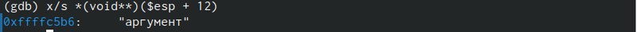{#fig:001 width=70%}

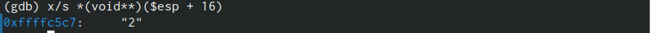{#fig:001 width=70%}

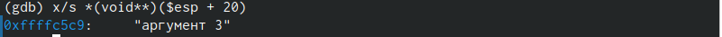{#fig:001 width=70%}

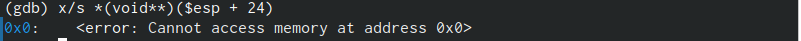{#fig:001 width=70%}

# Самостоятельная работа

**Задание 1**

Копирую файл, созданный в ходе выполнения предыдущей лабораторной (рис. @fig:001) , вношу изменения в текст (рис. @fig:001) и проверяю работу (рис. @fig:001).

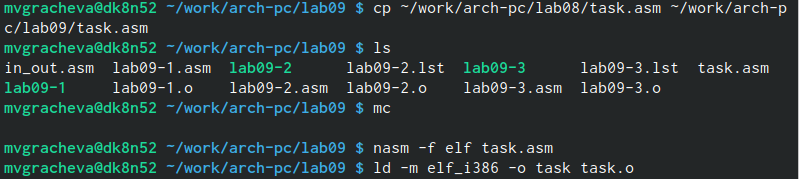{#fig:001 width=70%}

{#fig:001 width=70%}

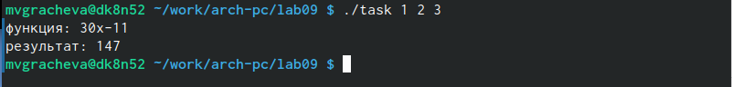{#fig:001 width=70%}

**Задание 2**

Создаю файл (рис. @fig:001), вношу текст (рис. @fig:001), проверяю работу файла (рис. @fig:001)

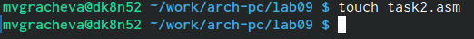{#fig:001 width=70%}

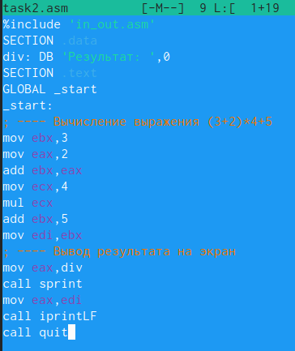{#fig:001 width=70%}

{#fig:001 width=70%}

Включите режим псевдографики (зарание изменив синтаксис для удобства). С помощью команды si поэтапно проверяю код и вижу, что значение после сложение сохраняется не в тот регистр(рис. @fig:001).

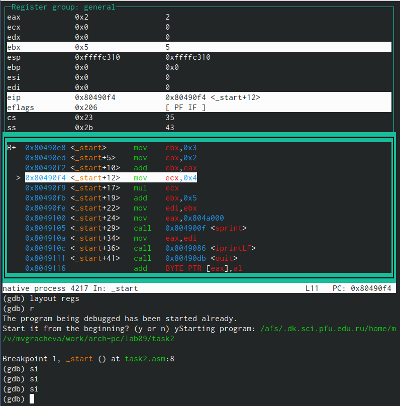{#fig:001 width=70%}

Меняю местами регистр + в дальнейших шагах меняем eax на ebx(рис. @fig:001).

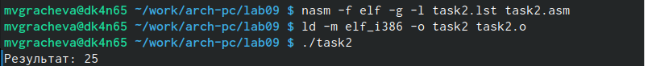{#fig:001 width=70%}

Проверяю работу файла (рис. @fig:001).

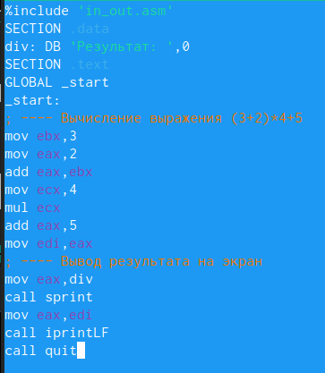{#fig:001 width=70%}

# Выводы

Приобрела навыки написания программ с использованием подпрограмм.Ознакомилась с методами отладки при помощи GDB и его основными возможностями.

# Список литературы{.unnumbered}

::: {#refs}
:::
