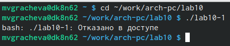

---
## Front matter
title: "Отчёт по лабораторной работе №10"
subtitle: "Работа с файлами средствами Nasm"
author: "Мария Валерьевна Грачева"

## Generic otions
lang: ru-RU
toc-title: "Содержание"

## Bibliography
bibliography: bib/cite.bib
csl: pandoc/csl/gost-r-7-0-5-2008-numeric.csl

## Pdf output format
toc: true # Table of contents
toc-depth: 2
lof: true # List of figures
lot: true # List of tables
fontsize: 12pt
linestretch: 1.5
papersize: a4
documentclass: scrreprt
## I18n polyglossia
polyglossia-lang:
  name: russian
  options:
	- spelling=modern
	- babelshorthands=true
polyglossia-otherlangs:
  name: english
## I18n babel
babel-lang: russian
babel-otherlangs: english
## Fonts
mainfont: PT Serif
romanfont: PT Serif
sansfont: PT Sans
monofont: PT Mono
mainfontoptions: Ligatures=TeX
romanfontoptions: Ligatures=TeX
sansfontoptions: Ligatures=TeX,Scale=MatchLowercase
monofontoptions: Scale=MatchLowercase,Scale=0.9
## Biblatex
biblatex: true
biblio-style: "gost-numeric"
biblatexoptions:
  - parentracker=true
  - backend=biber
  - hyperref=auto
  - language=auto
  - autolang=other*
  - citestyle=gost-numeric
## Pandoc-crossref LaTeX customization
figureTitle: "Рис."
tableTitle: "Таблица"
listingTitle: "Листинг"
lofTitle: "Список иллюстраций"
lotTitle: "Список таблиц"
lolTitle: "Листинги"
## Misc options
indent: true
header-includes:
  - \usepackage{indentfirst}
  - \usepackage{float} # keep figures where there are in the text
  - \floatplacement{figure}{H} # keep figures where there are in the text
---

# Цель работы

Приобретение навыков написания программ для работы с файлами.

# Теоретическое введение

Права доступа определяют набор действий (чтение, запись, выполнение), разрешённых для выполнения пользователям системы над файлами. Для каждого файла пользователь может входить в одну из трех групп: владелец, член группы владельца, все остальные. Для каждой из этих групп может быть установлен свой набор прав доступа. 

Набор прав доступа задается тройками битов и состоит из прав на чтение, запись и исполнение файла. В символьном представлении он имеет вид строк rwx, где вместо любого символа может стоять дефис. Всего возможно 8 комбинаций, приведенных в таблице 10.1. Буква означает наличие права (установлен в единицу второй бит триады r — чтение, первый бит w — запись, нулевой бит х — исполнение), а дефис означает отсутствие права (нулевое значение соответствующего бита). 

В операционной системе Linux существуют различные методы управления файлами, например, такие как создание и открытие файла, только для чтения или для чтения и записи, добавления в существующий файл, закрытия и удаления файла, предоставление прав доступа.

Обработка файлов в операционной системе Linux осуществляется за счет использования определенных системных вызовов. Для корректной работы и доступа к файлу при его открытии или создании, файлу присваивается уникальный номер (16-битное целое число) – дескриптор файла.

В таблице приведены системные вызовы для обработки файлов (рис. @fig:001).

{#fig:001 width=70%}

# Выполнение лабораторной работы

 Создаю каталог для программам лабораторной работы No 10, перехожу в него и создаю файлы lab10-1.asm, readme-1.txt и readme-2.txt(рис. @fig:002).

{#fig:002 width=70%}

 Ввожу в файл lab10-1.asm текст программы из листинга 10.1 (Программа записи в файл сообщения). Создаю исполняемый файл и проверяю его работу(рис. @fig:003), (рис. @fig:004)

{#fig:003 width=70%}

{#fig:004 width=70%}

 С помощью команды chmod изменяю права доступа к исполняемому файлу lab10-1, запретив его выполнение. Попытаюсь выполнить файл. У нас нет прав доступа, так как командой ранее запретили исполнение (рис. @fig:005), (рис. @fig:006).

{#fig:005 width=70%}

{#fig:006 width=70%}

 С помощью команды chmod изменяю права доступа к файлу lab10-1.asm с исходным текстом программы, добавив права на исполнение. Попытаюсь выполнить его. Всё получается, но доступ к текстовому файлу всё ещё закрыт (рис. @fig:007), (рис. @fig:008).

{#fig:007 width=70%}

{#fig:008 width=70%}

 В соответствии с вариантом в таблице 10.4 предоставила права доступа к файлу readme-1.txt представленные в символьном виде, а для файла readme-2.txt – в двочном виде. Проверила правильность выполнения с помощью команды ls -l.(рис. @fig:009), (рис. @fig:010)

{#fig:009 width=70%}

{#fig:010 width=70%}

# Выполнение самостоятельной работы

Написала программу (рис. @fig:011), (рис. @fig:012)

{#fig:011 width=70%}

{#fig:012 width=70%}

Проверяю работу (рис. @fig:013).

{#fig:013 width=70%}

# Выводы

Приобрела навыки написания программ для работы с файлами.

# Список литературы{.unnumbered}

::: {#refs}
:::
